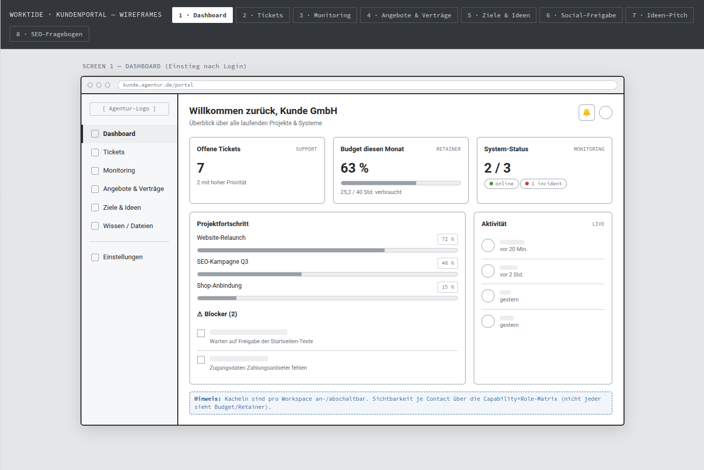
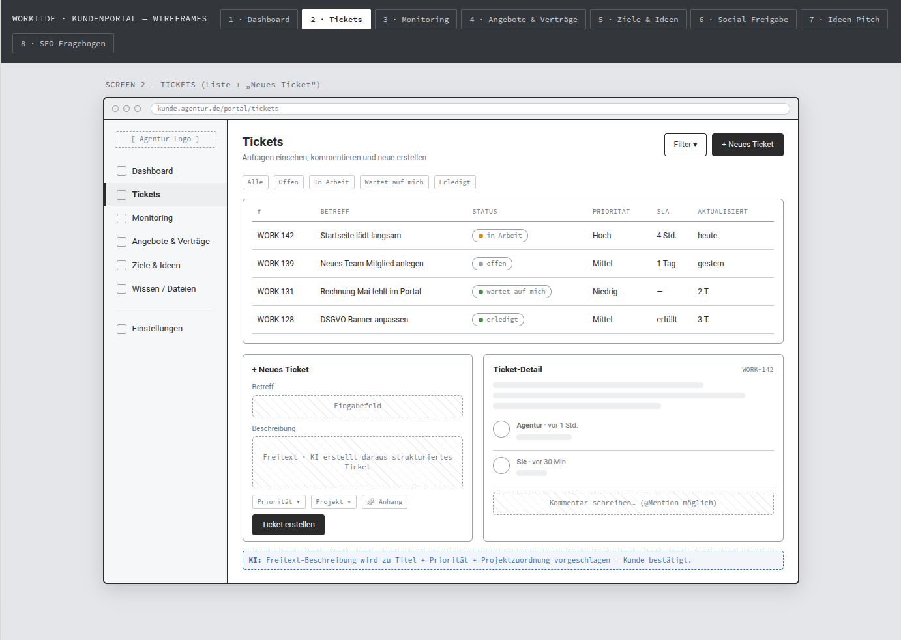
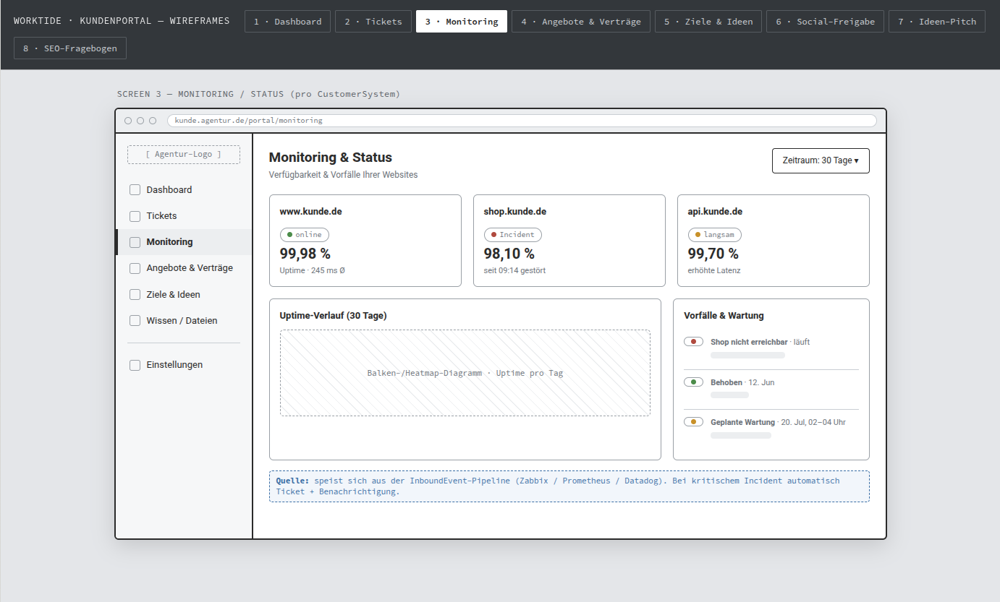
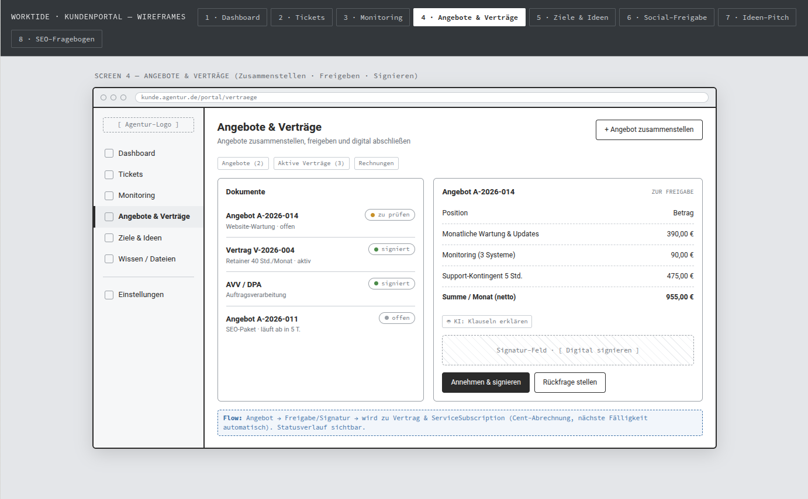
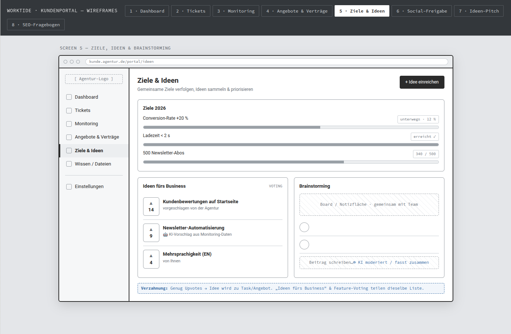
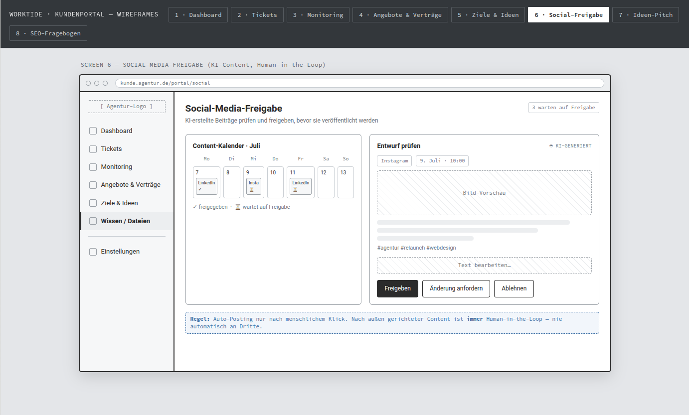
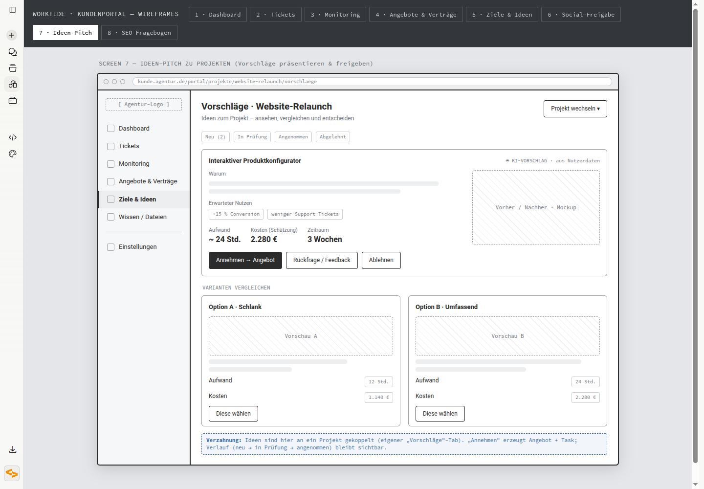
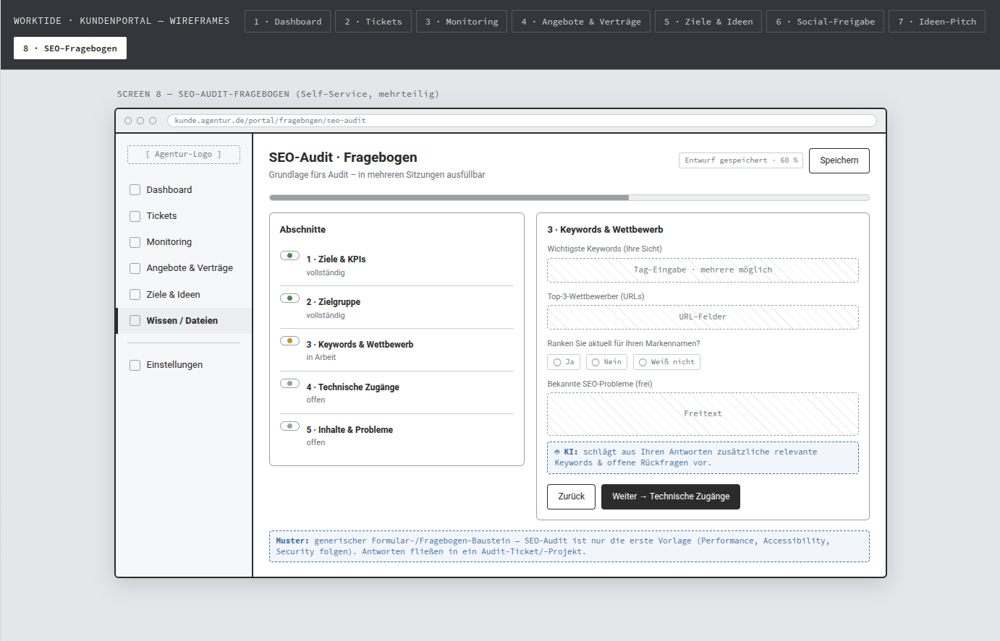

# Worktide · Kundenportal — Wireframes

Transcribed from the Claude artifact `72a2afde-f868-4291-8ff6-159a4dd721b3`
(retrieved 2026-07-04). Raw artifact HTML: [`source.html`](./source.html).
Screenshots per screen are linked below.

The portal is the **customer-facing** UI for external CRM contacts (see
`../PLAN.md`). Layout is a fixed left nav + main content. Recurring nav items:
Dashboard · Tickets · Monitoring · Angebote & Verträge · Ziele & Ideen ·
Wissen / Dateien · Einstellungen.

---

## Screen 1 — Dashboard (entry after login)

URL: `kunde.agentur.de/portal`

- Header: "Willkommen zurück, Kunde GmbH" · "Überblick über alle laufenden Projekte & Systeme" · 🔔
- **Three KPI tiles:**
  - *Offene Tickets* (SUPPORT): 7 · "2 mit hoher Priorität"
  - *Budget diesen Monat* (RETAINER): 63 % · "25,2 / 40 Std. verbraucht"
  - *System-Status* (MONITORING): 2 / 3 · "online · 1 incident"
- **Projektfortschritt:** Website-Relaunch 72 % · SEO-Kampagne Q3 40 % · Shop-Anbindung 15 %
- **⚠ Blocker (2):** "Warten auf Freigabe der Startseiten-Texte" · "Zugangsdaten Zahlungsanbieter fehlen"
- **Aktivität (LIVE):** timeline — vor 20 Min. / vor 2 Std. / gestern / gestern
- **Hinweis:** Kacheln sind pro Workspace an-/abschaltbar. Sichtbarkeit je Contact über die **Capability×Role-Matrix** (nicht jeder sieht Budget/Retainer).

---

## Screen 2 — Tickets (list + "Neues Ticket")

URL: `kunde.agentur.de/portal/tickets`

- Toolbar: "Filter ▾" · "+ Neues Ticket"
- Filter chips: Alle · Offen · In Arbeit · Wartet auf mich · Erledigt
- **Table** (# · Betreff · Status · Priorität · SLA · Aktualisiert):
  - WORK-142 · Startseite lädt langsam · in Arbeit · Hoch · 4 Std. · heute
  - WORK-139 · Neues Team-Mitglied anlegen · offen · Mittel · 1 Tag · gestern
  - WORK-131 · Rechnung Mai fehlt im Portal · wartet auf mich · Niedrig · — · 2 T.
  - WORK-128 · DSGVO-Banner anpassen · erledigt · Mittel · erfüllt · 3 T.
- **New-ticket form:** Betreff · Beschreibung (Freitext) · Priorität ▾ · Projekt ▾ · 📎 Anhang · "Ticket erstellen"
- **Ticket detail:** WORK-142 · thread ("Agentur · vor 1 Std.", "Sie · vor 30 Min.") · Kommentar mit @Mention
- **KI:** Freitext-Beschreibung → vorgeschlagener Titel + Priorität + Projektzuordnung, Kunde bestätigt.

---

## Screen 3 — Monitoring / Status (per CustomerSystem)

URL: `kunde.agentur.de/portal/monitoring`

- "Zeitraum: 30 Tage ▾"
- **System cards:**
  - www.kunde.de · online · 99,98 % Uptime · 245 ms Ø
  - shop.kunde.de · Incident · 98,10 % · "seit 09:14 gestört"
  - api.kunde.de · langsam · 99,70 % · "erhöhte Latenz"
- **Uptime-Verlauf (30 Tage):** bar/heatmap, uptime per day
- **Vorfälle & Wartung:** "Shop nicht erreichbar · läuft" · "Behoben · 12. Jun" · "Geplante Wartung · 20. Jul, 02–04 Uhr"
- **Quelle:** InboundEvent-Pipeline (Zabbix / Prometheus / Datadog). Kritischer Incident → automatisch Ticket + Benachrichtigung.

---

## Screen 4 — Angebote & Verträge (compile · approve · sign)

URL: `kunde.agentur.de/portal/vertraege`

- "+ Angebot zusammenstellen"
- Tabs: Angebote (2) · Aktive Verträge (3) · Rechnungen · Dokumente
  - Angebot A-2026-014 · Website-Wartung · offen · "zu prüfen"
  - Vertrag V-2026-004 · Retainer 40 Std./Monat · aktiv · "signiert"
  - AVV / DPA · Auftragsverarbeitung · "signiert"
  - Angebot A-2026-011 · SEO-Paket · "läuft ab in 5 T." · offen
- **Offer detail A-2026-014 (ZUR FREIGABE):** line items
  - Monatliche Wartung & Updates — 390,00 €
  - Monitoring (3 Systeme) — 90,00 €
  - Support-Kontingent 5 Std. — 475,00 €
  - **Summe / Monat (netto): 955,00 €**
  - 🤖 KI: Klauseln erklären · Signatur-Feld [Digital signieren] · "Annehmen & signieren" · "Rückfrage stellen"
- **Flow:** Angebot → Freigabe/Signatur → wird zu Vertrag & **ServiceSubscription** (Cent-Abrechnung, nächste Fälligkeit automatisch). Statusverlauf sichtbar.

---

## Screen 5 — Ziele, Ideen & Brainstorming

URL: `kunde.agentur.de/portal/ideen`

- "+ Idee einreichen"
- **Ziele 2026:** Conversion-Rate +20 % (unterwegs · 12 %) · Ladezeit < 2 s (erreicht ✓) · 500 Newsletter-Abos (340 / 500)
- **Ideen fürs Business (VOTING, upvotes):**
  - ▲14 Kundenbewertungen auf Startseite — vorgeschlagen von der Agentur
  - ▲9 Newsletter-Automatisierung — 🤖 KI-Vorschlag aus Monitoring-Daten
  - ▲4 Mehrsprachigkeit (EN) — von Ihnen
- **Brainstorming:** shared board / notes with team · "Beitrag schreiben…" · 🤖 KI moderiert / fasst zusammen
- **Verzahnung:** genug Upvotes → Idee wird zu Task/Angebot. "Ideen fürs Business" & Feature-Voting teilen dieselbe Liste.

---

## Screen 6 — Social-Media-Freigabe (AI content, human-in-the-loop)

URL: `kunde.agentur.de/portal/social`

- "3 warten auf Freigabe"
- **Content-Kalender · Juli** (Mo–So): 7 LinkedIn ✓ · 9 Insta ⏳ · 11 LinkedIn ⏳ (✓ freigegeben · ⏳ wartet auf Freigabe)
- **Entwurf prüfen (🤖 KI-GENERIERT):** Instagram · 9. Juli · 10:00 · Bild-Vorschau · "#agentur #relaunch #webdesign" · "Text bearbeiten…" · Freigeben / Änderung anfordern / Ablehnen
- **Regel:** Auto-Posting nur nach menschlichem Klick. Nach außen gerichteter Content ist immer **Human-in-the-Loop** — nie automatisch an Dritte.

---

## Screen 7 — Ideen-Pitch zu Projekten (present & approve proposals)

URL: `kunde.agentur.de/portal/projekte/website-relaunch/vorschlaege`

- "Vorschläge · Website-Relaunch" · "Projekt wechseln ▾"
- Tabs: Neu (2) · In Prüfung · Angenommen · Abgelehnt
- **Proposal "Interaktiver Produktkonfigurator" (🤖 KI-VORSCHLAG · aus Nutzerdaten):**
  - Warum · Erwarteter Nutzen: +15 % Conversion, weniger Support-Tickets
  - Aufwand ~24 Std. · Kosten (Schätzung) 2.280 € · Zeitraum 3 Wochen
  - Vorher / Nachher · Mockup · "Annehmen → Angebot" / "Rückfrage / Feedback" / "Ablehnen"
- **VARIANTEN VERGLEICHEN:** Option A · Schlank (12 Std., 1.140 €) vs. Option B · Umfassend (24 Std., 2.280 €), each "Diese wählen"
- **Verzahnung:** Ideen hier an ein Projekt gekoppelt (eigener "Vorschläge"-Tab). "Annehmen" erzeugt Angebot + Task; Verlauf (neu → in Prüfung → angenommen) bleibt sichtbar.

---

## Screen 8 — SEO-Audit-Fragebogen (self-service, multi-part)

URL: `kunde.agentur.de/portal/fragebogen/seo-audit`

- "Entwurf gespeichert · 60 %" · "Speichern"
- **Abschnitte:** 1 Ziele & KPIs (vollständig) · 2 Zielgruppe (vollständig) · 3 Keywords & Wettbewerb (in Arbeit) · 4 Technische Zugänge (offen) · 5 Inhalte & Probleme (offen)
- **Section 3 (Keywords & Wettbewerb):** Wichtigste Keywords (Tag-Eingabe) · Top-3-Wettbewerber (URL-Felder) · "Ranken Sie aktuell für Ihren Markennamen?" (Ja/Nein/Weiß nicht) · Bekannte SEO-Probleme (Freitext)
- 🤖 KI: schlägt aus Antworten zusätzliche Keywords & offene Rückfragen vor.
- Nav: Zurück · "Weiter → Technische Zugänge"
- **Muster:** generischer Formular-/Fragebogen-Baustein — SEO-Audit ist nur die erste Vorlage (Performance, Accessibility, Security folgen). Antworten fließen in ein Audit-Ticket/-Projekt.

---

### Cross-cutting themes
- **AI-assisted, human-approved** throughout: ticket structuring, clause explanation, idea/keyword suggestions, social content — but publishing/acceptance is always an explicit human click.
- **Everything routes back to core entities:** tickets → Task, offers → Vertrag/ServiceSubscription, ideas/proposals → Task/Angebot, questionnaire → Audit-Ticket.
- **Per-workspace + per-contact visibility** via the Capability×Role matrix — tiles and sections are individually gated (e.g. budget/retainer hidden from some contacts).
